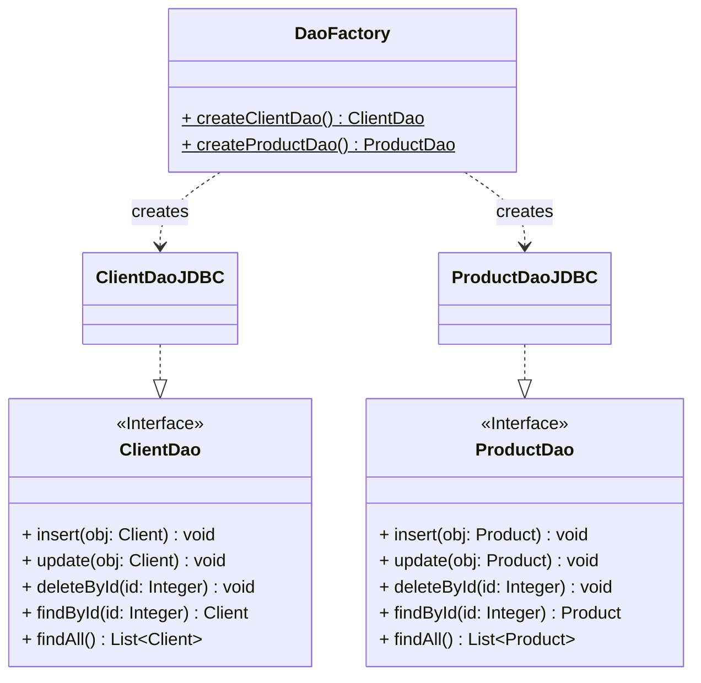
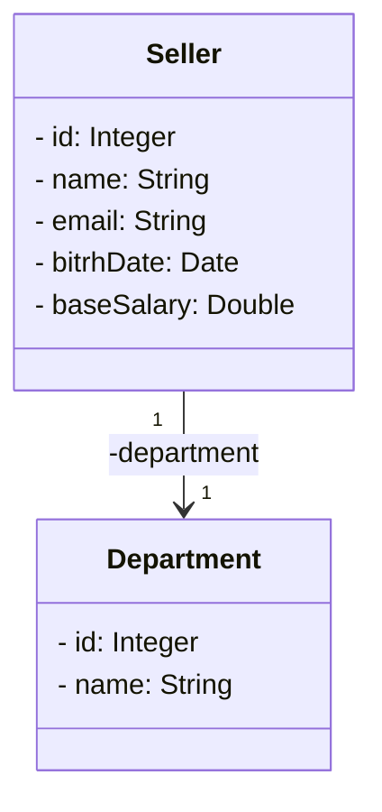

# Complete Java and Spring Boot course
A repo for files from https://www.udemy.com/course/java-curso-completo

> This project refers to a JDBC DAO module from the course

## Database setup

1. Install Docker or Podman
2. Run
```bash
podman run --name my-postgres -p 5432:5432 -e POSTGRES_PASSWORD=example -d postgres
```
3. Reference the Postgres Java Connector in Project Structure > Libraries (IntelliJ)

## About transactions

https://www.ibm.com/docs/en/cics-ts/5.4?topic=processing-acid-properties-transactions

## DAO (Data Access Object - pattern) Diagram



## Entities


